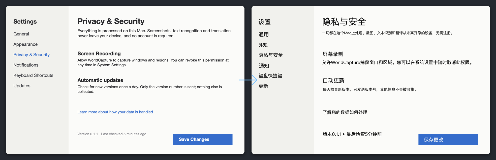

# WorldCapture

[中文](README.md) · **English** · [日本語](README.ja.md)

Screenshots, screen recording and **in-place image translation** for macOS. Capture a foreign-language UI and the translation is laid right over the original text; select a region of the screen and subtitles or chat keep translating as they change. Everything runs on your Mac: **free, MIT, no account, no telemetry, no watermark, 15 MB.**



## Download

- [Website](https://worldcapture.fukumoto.jp/) · [GitHub Releases](https://github.com/fukumotomakoto/worldcapture/releases)
- macOS 15 or later, Apple Silicon and Intel. The Apple Intelligence engine needs macOS 26 with Apple Intelligence on; otherwise the system translator is used.
- Signed and notarized, with optional automatic updates.

## What it does

**Translation**
- **Translate Image**: recognizes the text in a screenshot, translates it paragraph by paragraph and lays each translation back where the original was. Font size follows the original, the background is sampled from the surrounding pixels, and every block can be moved, resized or deleted and is exported with the image.
- **Live Lens** (⌘⇧6): select a screen region; it is recognized continuously and the translation is overlaid in place, click-through. For subtitles, live chat and UIs that keep changing.
- **Extract Text**: translate inside the OCR panel, original and translation side by side, with a target-language picker and a separate copy button.
- **Engines and glossary**: Apple Intelligence (on-device model) or the system translator, neither goes online. A built-in glossary of common UI terms for Chinese and Japanese, plus your own entries in `~/Documents/WorldCapture/glossary.txt`.

**Capture and record**
- Region, full screen, window (floating panels included), scrolling capture, timed capture.
- Screen / region / window recording with system audio and microphone, GIF.
- Annotations: rectangle, ellipse, arrow, text, numbers, mosaic, freehand, crop; pin to screen (click-through); history library.

**Ways in**
- Top toolbar: a small tab under the menu bar that slides out on hover. Can be turned off in Settings.
- Menu bar icon and global shortcuts (⌘⇧2 for region capture, and more).
- Assistant sidebar: Claude or ChatGPT web embedded in the main window with your own account; "Send to Assistant" puts the screenshot on the clipboard, paste and send.
- Safari extension: full-page capture and in-browser OCR, with hand-off to the app.

## Privacy

Screenshots, recordings, text recognition and translation never leave this Mac. No account, no analytics. The only network activity is the optional update check and the assistant sidebar you sign into yourself. See the [privacy policy](PRIVACY.md).

## Build from source

```bash
cd macos && swift test
cd .. && xcodegen generate
xcodebuild -project WorldCapture.xcodeproj -scheme WorldCapture \
  -configuration Debug -derivedDataPath .derived-data build
```

Development, permissions and the release process are in [docs/DEVELOPMENT.md](docs/DEVELOPMENT.md); architecture in [docs/ARCHITECTURE.md](docs/ARCHITECTURE.md).

## License and sponsorship

[MIT](LICENSE). The distribution bundles Sparkle (updates) and Tesseract.js (in-browser OCR); see [THIRD-PARTY-NOTICES.md](THIRD-PARTY-NOTICES.md).

WorldCapture is not commercial and is sustained by sponsorship. If it is useful to you, consider supporting it through GitHub Sponsors.
