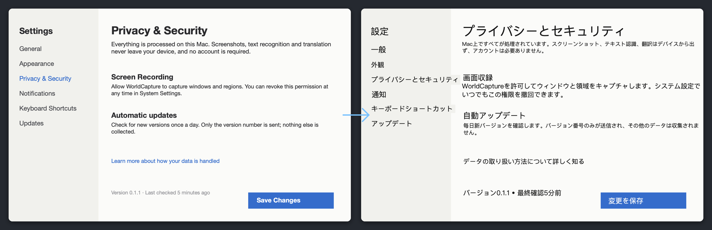

# WorldCapture

[中文](README.md) · [English](README.en.md) · **日本語**

macOS 向けのスクリーンショット・画面収録・**画像上翻訳**ツール。外国語の画面を撮ると、訳文が元の文字の位置にそのまま重なります。画面の一部を選べば、字幕やチャットが変わるたびに翻訳が追いかけます。処理はすべてこの Mac の中だけ：**無料・MIT・アカウント不要・テレメトリなし・透かしなし・15 MB。**



## ダウンロード

- [公式サイト](https://worldcapture.fukumoto.jp/) · [GitHub Releases](https://github.com/fukumotomakoto/worldcapture/releases)
- macOS 15 以降、Apple シリコンと Intel の両対応。Apple Intelligence エンジンは macOS 26 で Apple Intelligence を有効にした環境が必要で、それ以外ではシステム翻訳を使います。
- 署名・公証済み。自動アップデート内蔵（オフにできます）。

## できること

**翻訳**
- **画像を翻訳**：スクリーンショット内の文字を認識し、段落ごとに翻訳して元の位置に重ねます。文字サイズは原文に合わせ、背景色は周囲のピクセルから取ります。各ブロックは移動・拡縮・削除でき、書き出しにも含まれます。
- **翻訳レンズ**（⌘⇧6）：画面の範囲を選ぶと、継続的に認識して訳文をその場に重ねます（クリックは透過）。字幕、ライブ配信のコメント、更新され続ける画面に。
- **テキスト抽出**：OCR パネル内で原文｜訳文を並べて翻訳。翻訳先の言語を選べ、訳文だけコピーできます。
- **エンジンと用語集**：Apple Intelligence（オンデバイスモデル）またはシステム翻訳。どちらも通信しません。UI でよく使う語の中国語・日本語訳を内蔵し、`~/Documents/WorldCapture/glossary.txt` に自分の用語を追加できます。

**キャプチャと録画**
- 範囲、全画面、ウィンドウ（フローティングパネル含む）、スクロールキャプチャ、タイマー撮影。
- 画面／範囲／ウィンドウの録画、システム音声とマイク、GIF。
- 注釈：矩形、楕円、矢印、テキスト、番号、モザイク、フリーハンド、トリミング。画面にピン留め（クリック透過）。履歴ライブラリ。

**入口**
- 上部ツールバー：メニューバー直下の小さなタブ。ポインタを合わせるとボタンが滑り出ます。設定でオフにできます。
- メニューバーアイコンとグローバルショートカット（⌘⇧2 で範囲キャプチャなど）。
- アシスタントサイドバー：メインウインドウに Claude または ChatGPT の Web 版を自分のアカウントで埋め込み。「アシスタントへ送る」でスクショをクリップボードに入れ、貼り付けて送信。
- Safari 機能拡張：ページ全体のキャプチャとブラウザ内 OCR。App に引き継いで編集できます。

## プライバシー

スクリーンショット、録画、文字認識、翻訳はこの Mac から出ません。アカウントも計測もありません。通信するのは任意のアップデート確認と、自分でサインインするアシスタントサイドバーだけです。詳しくは[プライバシーポリシー](PRIVACY.md)。

## ソースからビルド

```bash
cd macos && swift test
cd .. && xcodegen generate
xcodebuild -project WorldCapture.xcodeproj -scheme WorldCapture \
  -configuration Debug -derivedDataPath .derived-data build
```

開発・権限・リリース手順は [docs/DEVELOPMENT.md](docs/DEVELOPMENT.md)、構成は [docs/ARCHITECTURE.md](docs/ARCHITECTURE.md) を参照。

## ライセンスとスポンサー

[MIT](LICENSE)。配布版には Sparkle（アップデート）と Tesseract.js（ブラウザ内 OCR）を同梱しています。[THIRD-PARTY-NOTICES.md](THIRD-PARTY-NOTICES.md) を参照。

WorldCapture は商用化せず、スポンサーで開発を続けています。役に立ったら GitHub Sponsors での支援をお願いします。
